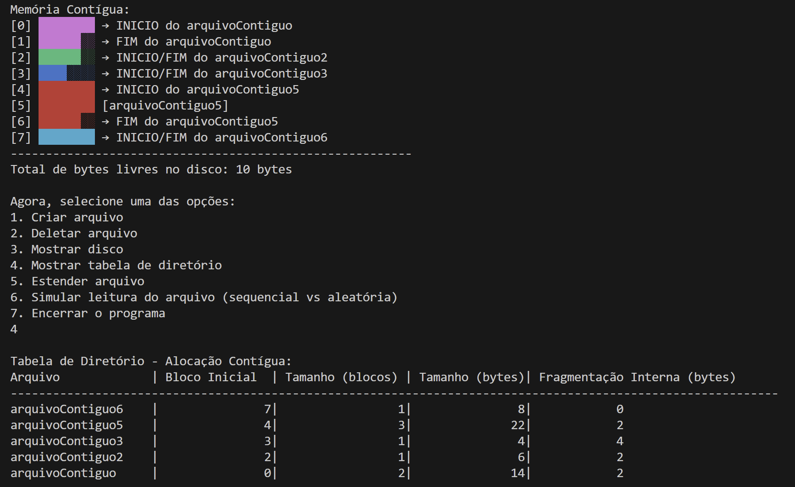
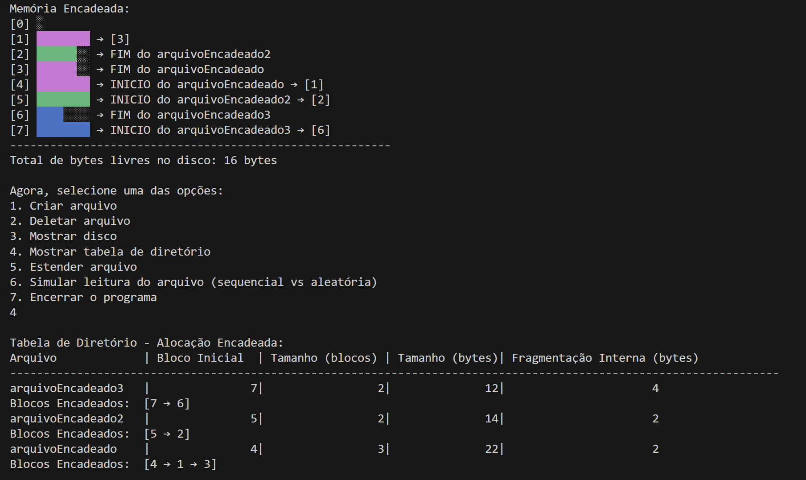
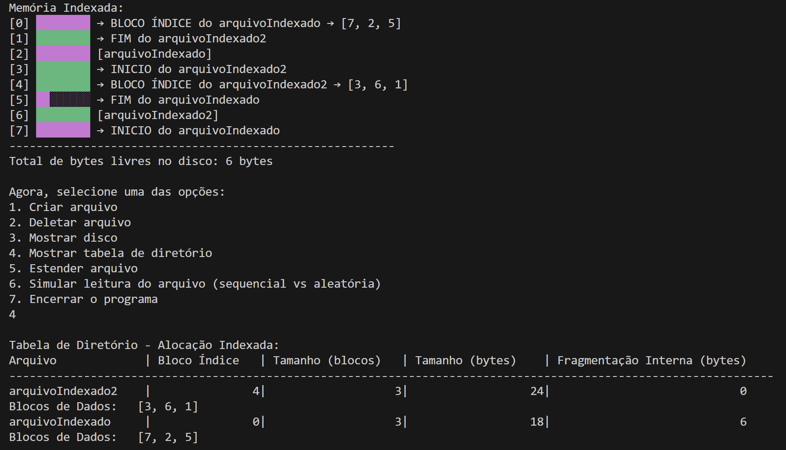

# TDE SO II

Yasmim Eckert Ferri (183395@upf.br)
Felipe Pegoraro Lussi (135044@upf.br)

---

### Descrição do projeto:

Nosso projeto implementa um simulador de alocação de arquivos em disco, com suporte a três métodos de alocação:
- Contígua
- Encadeada
- Indexada

O usuário define inicialmente o tamanho do disco em bytes, que é subdividido em blocos lógicos fixos de 8 bytes. O sistema, então, oferece um menu de operações, onde é possível:

1. Criar arquivos (alocados conforme o método escolhido).
2. Deletar arquivos.
3. Mostrar o estado atual do disco no terminal.
4. Exibir a tabela de diretório de cada arquivo.
5. Estender arquivos já existentes.
6. Simular leitura de arquivos (sequencial vs. aleatória).

O simulador também inclui tratamento de entradas inválidas, evitando falhas quando o usuário fornece valores incorretos.

---

### Foi desenvolvido em C++ e com visualização no terminal.

--- 

### Instruções de compilação e execução:

Pré-requisitos:
- Ter um compilador C++ instalado, como g++ (GNU Compiler) no Linux, WSL, macOS ou MinGW no Windows.
- Terminal ou PowerShell para executar os comandos.s

#### Compilação:

No terminal, navegue até a pasta onde está o arquivo TDE_Simulador_Arquivos.cpp e execute:

g++ -std=c++17 -o TDE_Simulador_Arquivos TDE_Simulador_Arquivos.cpp

#### Execução:

##### Recomenda-se executar no terminal usando Linux ou WSL no Windows.

No Linux/WSL:

./TDE_Simulador_Arquivos

---

### Bibliotecas necessárias:

O projeto utiliza apenas bibliotecas padrão da linguagem C++ (STL), não sendo necessária a instalação de pacotes externos.
- iostream: para entrada e saída de dados.
- vector: representação do disco e listas de blocos.
- unordered_map: tabelas de diretórios.
- string: manipulação de nomes de arquivos.
- algorithm: funções como busca, ordenação, etc.
- iomanip: formatação de saída para tabelas e alinhamentos.
- random: para a geração de blocos aleatórios.

---

### Decisões do projeto

- Bloco fixo de 8 bytes: adotado para simplificar cálculos de fragmentação e visualização.
- Struct File: armazena metadados de cada arquivo (nome, tamanho, blocos ocupados, ponteiros, bloco índice).
- Visualização do disco:
    Blocos livres → ░
    Blocos ocupados → █
- Menu interativo: permite ao usuário escolher operações de forma simples e repetitiva, até encerrar o programa.
- Tratamento de entradas inválidas: previne erros ao digitar valores não numéricos ou fora dos limites (digitar uma letra no lugar de um número).
- Monolítica modular: todo o simulador está contido em um único programa, mas organizado em funções separadas para cada funcionalidade.

---

### Exemplos de uso do simulador

Alocação contígua:

Alocação encadeada:

Alocação indexada:
